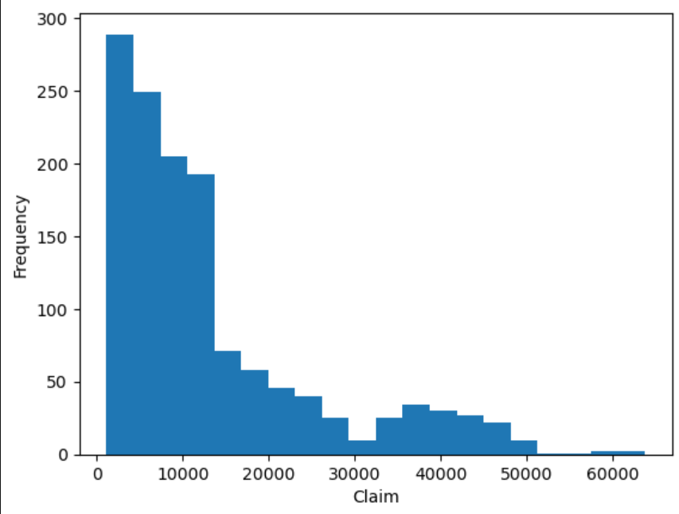
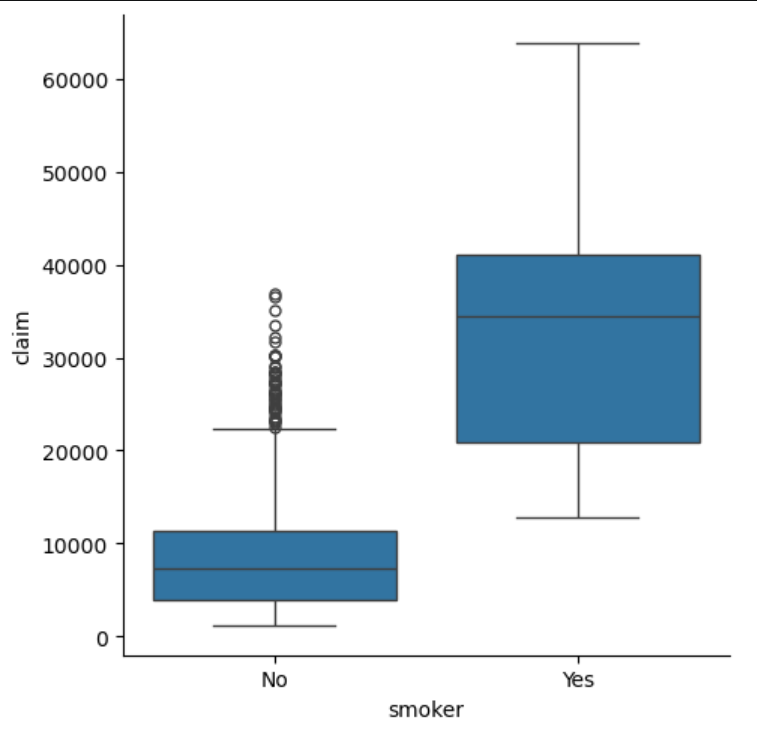
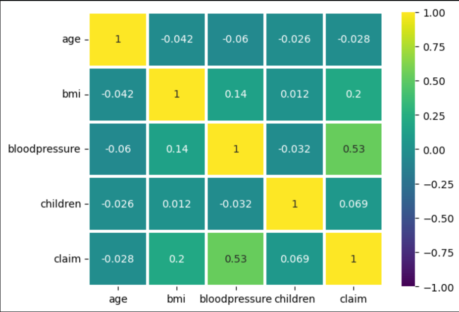
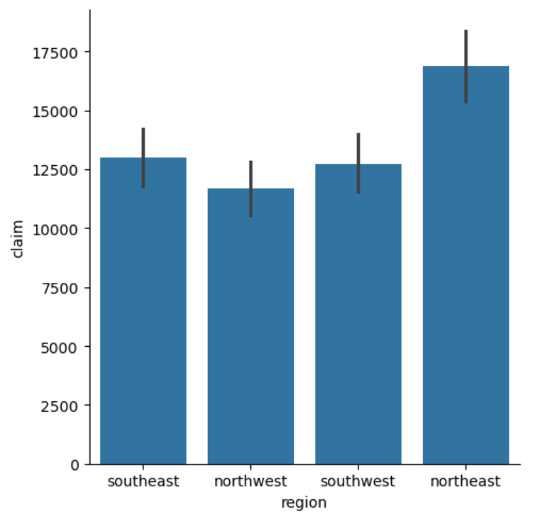
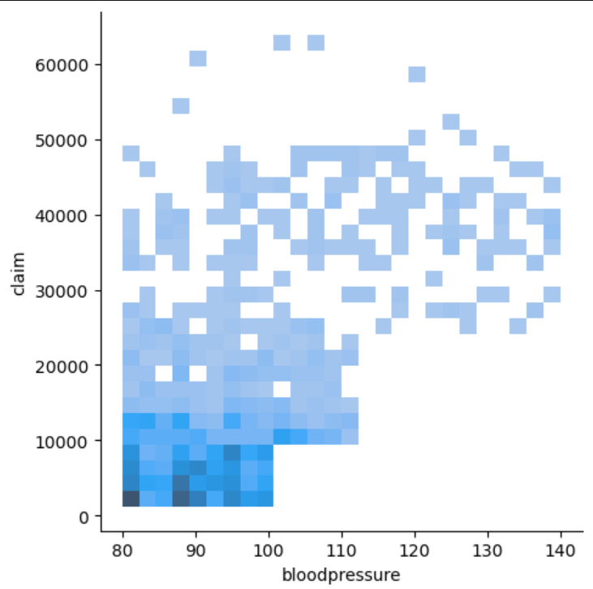
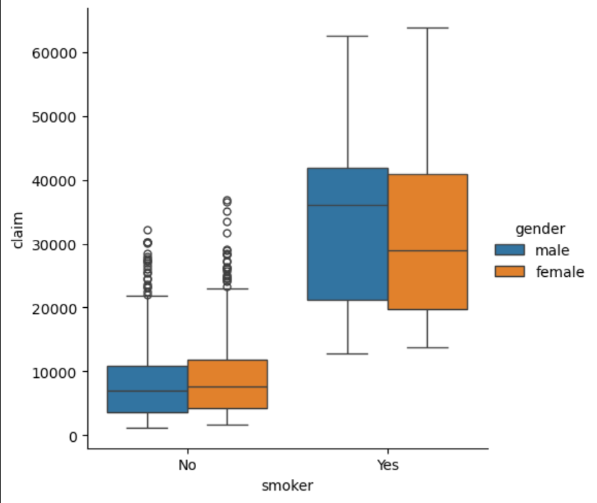

# Insurance Claim  - Exploratory Data Analysis

##  Project Overview
This project performs Exploratory Data Analysis (EDA) on an insurance dataset to uncover patterns affecting medical insurance claim.

##  Objectives
- Understand the dataset
- Clean missing values
- Perform Univariate Analysis
- Perform Bivariate Analysis
- Perform Multivariate Analysis
- Generate insights using visualizations

## Technologies Used
- Python
- Pandas
- NumPy
- Matplotlib
- Seaborn
- Jupyter Notebook

##  Dataset Features
- Age
- Sex
- BMI
- Children
- Smoker
- Region
- Charges
- Diabetes
- Blood Pressure

##  Analysis Performed
### Data Cleaning
- Handled missing values

### Univariate Analysis
- Histograms
- Countplots
- Boxplots
- KDE plots
- Pie charts

### Bivariate Analysis
- Scatterplots
- 2d KDE plots
- Box plots
- Bar plots
- Point plots

### Multivariate Analysis
- Correlation Heatmap
- Grouped box plot

##  Key Insights
- Smoking status has the greatest impact on insurance claim amounts.
- Blood pressure is moderately positively correlated with insurance claim amounts.
- BMI has a weak positive relationship with insurance claim amounts.
- Gender and diabetic status have little influence on claim amounts.
- The number of children has minimal impact on insurance claims.
- Regional differences exist in the dataset.
- The dataset contains several high-value claim outliers.

## 📊 Sample Visualizations

### Claim Distribution


### Smoker vs Claim


### Correlation Heatmap


### Region-wise Claim


### Bloodpressure vs Claim


### Smoker vs Claim(based on gender)


## Dataset

The dataset used in this project is available on Kaggle:

https://www.kaggle.com/datasets/thedevastator/insurance-claim-analysis-demographic-and-health

Download `insurance_data.csv` and place it in the project folder before running the notebook.

##  How to Run

1. Clone the repository:
```bash
git clone https://github.com/Avidny27/Insurance-EDA.git
```

2. Navigate to the project folder:
```bash
cd Insurance-EDA
```

3. Install the required libraries:
```bash
pip install -r requirements.txt
```

4. Download the dataset from Kaggle and place `insurance_data.csv` in the project folder.

5. Open the notebook:
```bash
jupyter notebook Insurance_EDA.ipynb
```
